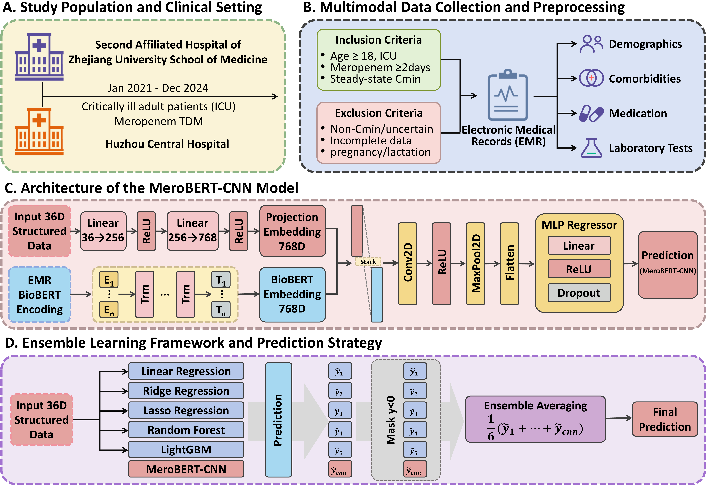

# MeroBERT-CNN

**A BioBERT-Enhanced Convolutional Fusion Model for Meropenem Trough Concentration Prediction**

---

## 📌 Overview

**MeroBERT-CNN** is a multimodal machine learning framework designed for predicting **meropenem trough concentrations (Cmin)** in critically ill adult patients.  
The model integrates **structured clinical variables** with **text-form biomedical representations** derived from electronic medical records (EMR), leveraging both classical machine learning and deep multimodal learning to improve robustness and interpretability.

This repository contains the full implementation of the MeroBERT-CNN architecture, ensemble learning strategy, and model evaluation pipeline.

---

## 🧠 Study Design and Model Architecture

The overall study workflow and model architecture are illustrated below:



The framework consists of four major components:

1. **Study Population and Clinical Setting**  
   ICU patients receiving meropenem therapy, with trough concentration monitoring.

2. **Multimodal Data Collection and Preprocessing**  
   Extraction of demographic data, comorbidities, medications, and laboratory results from EMR.

3. **MeroBERT-CNN Construction**  
   A convolutional fusion network combining BioBERT embeddings and projected structured features.

4. **Ensemble Learning Framework**  
   Integration of deep learning and classical regression models via ensemble averaging.

---

## 🏗 Model Architecture Details

### 1. Structured Feature Projection
- 36 structured clinical variables
- Two-layer nonlinear projection
- Output dimension: **768**

### 2. BioBERT Encoding
- Clinical variables converted into standardized textual descriptions
- Encoded using **BioBERT**
- Output dimension: **768**

### 3. Convolutional Fusion
- Stacked embedding: **2 × 768**
- 2D convolution with a **(2 × 2)** kernel
- ReLU activation and max pooling
- Flattening followed by an MLP regression head

### 4. Soft-Constrained Loss
- Relative error within **±30%** considered acceptable
- Additional penalty applied only when error exceeds this threshold
- Improves training stability and clinical relevance

---

## 🔗 Ensemble Learning Strategy

To complement the deep multimodal model, several classical regression models are trained using structured features alone:

- Linear Regression  
- Ridge Regression  
- Lasso Regression  
- Random Forest Regression  
- Gradient Boosting / LightGBM  

### Ensemble Rules:
- Negative predictions are masked to **0**
- Final prediction is the **arithmetic mean** of all model outputs, including MeroBERT-CNN

This strategy combines:
- Deep semantic representation learning
- Tabular inductive bias from classical ML
- Improved robustness and generalization

---

## 📊 Evaluation Metrics

Model performance is evaluated using:

- **R² (Coefficient of Determination)**
- **Mean Squared Error (MSE)**
- **Root Mean Squared Error (RMSE)**

Additional analyses include:
- Feature importance (Mask-0 / permutation)
- SHAP-based interpretation
- Ensemble ablation experiments

---

## 🛠 Requirements

```bash
python >= 3.8
pytorch >= 1.12
transformers
scikit-learn
pandas
numpy
lightgbm
shap
